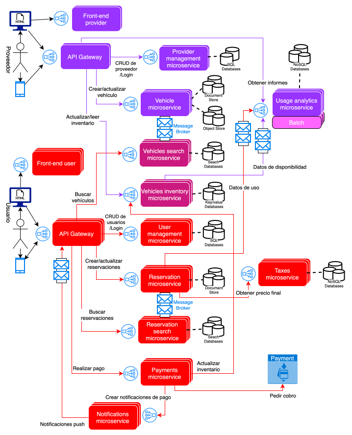

# Elementos arquitectónicos

En la arquitectura se observan diferentes elementos,

* Rectángulos con esquinas redondeadas doble:
  * Microservicio con mediana cantidad de réplicas
* Rectángulos con esquinas redondeadas triple:
  * Microservicio con alta cantidad de réplicas
* Dos cilindros: 
  * Bases de datos con mediana cantidad de réplicas
* Tres cilindros: 
  * Bases de datos con alta cantidad de réplicas
* Rectángulo con dos sobres en color azul:
  * MessageBroker
* Círculo con un cuadrado que apunta a tres cuadrados 
más pequeños:
  * Balanceador de carga

**TODO**: Podría ser bueno agregar conexiones faltantes entre microservicios

# JSON

<pre>
    Provider
{
  "providerId": number,
  "companyName": string,
  "email": string,
  "phone": string,
  "location": string
}
</pre>

<pre>
    Users
{
  "userId": number,
  "name": string,
  "email": string,
  "phone": string
}
</pre>

<pre>
    Vehicle
{
  "vehicleId": number,
  "brand": string,
  "model": string,
  "type": string,
  "pricePerDay": number,
  "location": string,
  "available": bool,
  "providerId": number
}
</pre>

<pre>
    Payment
{
  "paymentId": number,
  "reservationId": number,
  "amount": number,
  "paymentMethod": string,
  "status": string
}
</pre>

<pre>
    Reservation
{
  "reservationId": number,
  "userId": number,
  "vehicleId": number,
  "paymentId": number,
  "startDate": "yyyy-mm-dd",
  "endDate": "yyyy-mm-dd",
}
</pre>

TODO: Use proper JSON schemas
